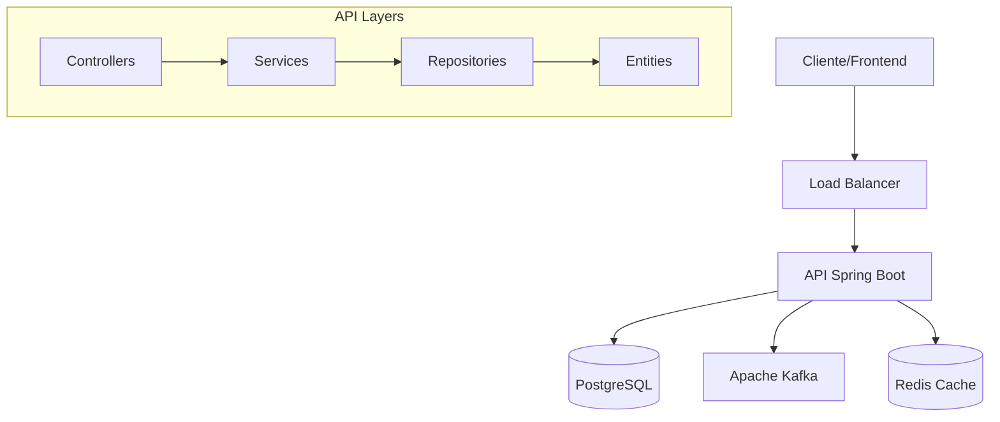
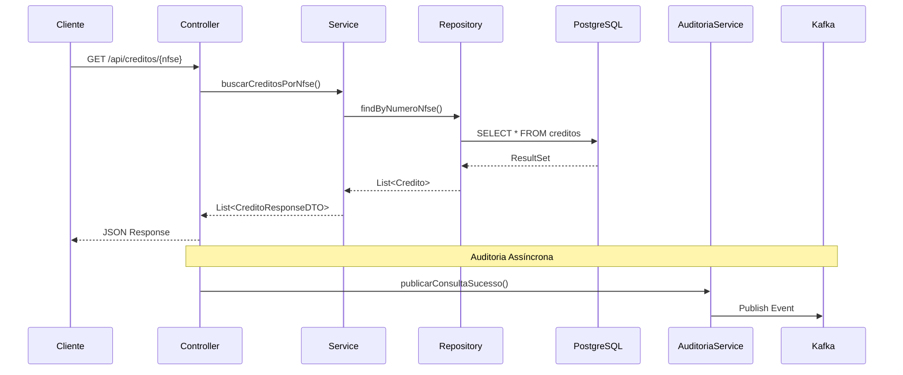

# Documentação Técnica - API de Consulta de Créditos

## 📋 Índice

1. [Visão Geral](#visão-geral)
2. [Arquitetura](#arquitetura)
3. [Tecnologias e Dependências](#tecnologias-e-dependências)
4. [Estrutura do Projeto](#estrutura-do-projeto)
5. [Modelo de Dados](#modelo-de-dados)
6. [APIs e Endpoints](#apis-e-endpoints)
7. [Integração com Kafka](#integração-com-kafka)
8. [Tratamento de Erros](#tratamento-de-erros)
9. [Testes](#testes)
10. [Performance e Otimizações](#performance-e-otimizações)
11. [Segurança](#segurança)
12. [Monitoramento](#monitoramento)

## 🎯 Visão Geral

A **API de Consulta de Créditos** é uma aplicação RESTful desenvolvida para atender aos requisitos do desafio técnico, fornecendo endpoints para consulta de créditos constituídos com base em números de NFS-e ou números de crédito.

### Objetivos Principais

- ✅ Fornecer consulta eficiente de créditos por NFS-e
- ✅ Permitir busca específica por número do crédito
- ✅ Implementar auditoria automática via Kafka (desafio extra)
- ✅ Garantir alta performance e escalabilidade
- ✅ Manter código limpo e testável
- ✅ Seguir melhores práticas de desenvolvimento

### Características Técnicas

- **Linguagem**: Java 21 (LTS)
- **Framework**: Spring Boot 3.2.0
- **Banco de Dados**: PostgreSQL 15+
- **Messaging**: Apache Kafka 3.5+
- **Arquitetura**: Clean Architecture + DDD
- **Padrões**: Repository, Service Layer, DTO

## 🏗️ Arquitetura

### Arquitetura Geral



### Padrões Arquiteturais

#### 1. Clean Architecture
- **Presentation Layer**: Controllers REST
- **Application Layer**: Services de aplicação
- **Domain Layer**: Entidades e regras de negócio
- **Infrastructure Layer**: Repositories e integrações externas

#### 2. Domain-Driven Design (DDD)
- **Entities**: Credito
- **Value Objects**: DTOs
- **Repositories**: Abstração de persistência
- **Services**: Lógica de domínio

#### 3. Dependency Injection
- Inversão de controle via Spring IoC
- Baixo acoplamento entre componentes
- Facilita testes unitários

### Fluxo de Requisição



## 🔧 Tecnologias e Dependências

### Core Dependencies

```xml
<!-- Spring Boot Starter -->
<dependency>
    <groupId>org.springframework.boot</groupId>
    <artifactId>spring-boot-starter-web</artifactId>
    <version>3.2.0</version>
</dependency>

<!-- Spring Data JPA -->
<dependency>
    <groupId>org.springframework.boot</groupId>
    <artifactId>spring-boot-starter-data-jpa</artifactId>
</dependency>

<!-- PostgreSQL Driver -->
<dependency>
    <groupId>org.postgresql</groupId>
    <artifactId>postgresql</artifactId>
    <scope>runtime</scope>
</dependency>

<!-- Spring Kafka -->
<dependency>
    <groupId>org.springframework.kafka</groupId>
    <artifactId>spring-kafka</artifactId>
</dependency>
```

### Utility Dependencies

```xml
<!-- Lombok -->
<dependency>
    <groupId>org.projectlombok</groupId>
    <artifactId>lombok</artifactId>
    <optional>true</optional>
</dependency>

<!-- MapStruct -->
<dependency>
    <groupId>org.mapstruct</groupId>
    <artifactId>mapstruct</artifactId>
    <version>1.5.5.Final</version>
</dependency>

<!-- Validation -->
<dependency>
    <groupId>org.springframework.boot</groupId>
    <artifactId>spring-boot-starter-validation</artifactId>
</dependency>
```

### Documentation Dependencies

```xml
<!-- SpringDoc OpenAPI -->
<dependency>
    <groupId>org.springdoc</groupId>
    <artifactId>springdoc-openapi-starter-webmvc-ui</artifactId>
    <version>2.2.0</version>
</dependency>
```

### Test Dependencies

```xml
<!-- Spring Boot Test -->
<dependency>
    <groupId>org.springframework.boot</groupId>
    <artifactId>spring-boot-starter-test</artifactId>
    <scope>test</scope>
</dependency>

<!-- Testcontainers -->
<dependency>
    <groupId>org.testcontainers</groupId>
    <artifactId>postgresql</artifactId>
    <scope>test</scope>
</dependency>
```

## 📁 Estrutura do Projeto

```
src/
├── main/
│   ├── java/br/com/api/creditos/
│   │   ├── config/                 # Configurações
│   │   │   ├── OpenApiConfig.java
│   │   │   ├── WebConfig.java
│   │   │   ├── KafkaConfig.java
│   │   │   └── AuditoriaInterceptor.java
│   │   ├── controller/             # Controllers REST
│   │   │   ├── CreditoController.java
│   │   │   └── HealthController.java
│   │   ├── dto/                    # Data Transfer Objects
│   │   │   ├── CreditoResponseDTO.java
│   │   │   ├── ErrorResponseDTO.java
│   │   │   └── CreditoMapper.java
│   │   ├── entity/                 # Entidades JPA
│   │   │   └── Credito.java
│   │   ├── exception/              # Exceções customizadas
│   │   │   ├── CreditoNotFoundException.java
│   │   │   └── GlobalExceptionHandler.java
│   │   ├── messaging/              # Integração Kafka
│   │   │   ├── AuditoriaService.java
│   │   │   └── event/
│   │   │       └── ConsultaCreditoEvent.java
│   │   ├── repository/             # Repositories JPA
│   │   │   └── CreditoRepository.java
│   │   ├── service/                # Lógica de negócio
│   │   │   ├── CreditoService.java
│   │   │   └── CreditoServiceImpl.java
│   │   └── ApiConsultaCreditosApplication.java
│   └── resources/
│       ├── application.yml
│       ├── application-dev.yml
│       ├── application-test.yml
│       ├── application-prod.yml
│       ├── application-docker.yml
│       └── db/migration/
│           ├── V1__Create_credito_table.sql
│           └── V2__Insert_sample_data.sql
└── test/
    └── java/br/com/api/creditos/
        ├── controller/
        ├── service/
        ├── repository/
        ├── messaging/
        └── integration/
```

## 💾 Modelo de Dados

### Entidade Principal: Credito

```sql
CREATE TABLE creditos (
    id BIGSERIAL PRIMARY KEY,
    numero_credito VARCHAR(50) NOT NULL UNIQUE,
    numero_nfse VARCHAR(50) NOT NULL,
    data_constituicao DATE NOT NULL,
    valor_issqn DECIMAL(15,2) NOT NULL,
    tipo_credito VARCHAR(50) NOT NULL,
    simples_nacional BOOLEAN NOT NULL DEFAULT false,
    aliquota DECIMAL(5,2) NOT NULL,
    valor_faturado DECIMAL(15,2) NOT NULL,
    valor_deducao DECIMAL(15,2) NOT NULL DEFAULT 0,
    base_calculo DECIMAL(15,2) NOT NULL,
    created_at TIMESTAMP DEFAULT CURRENT_TIMESTAMP,
    updated_at TIMESTAMP DEFAULT CURRENT_TIMESTAMP
);

-- Índices para performance
CREATE INDEX idx_creditos_numero_nfse ON creditos(numero_nfse);
CREATE INDEX idx_creditos_tipo_credito ON creditos(tipo_credito);
CREATE INDEX idx_creditos_data_constituicao ON creditos(data_constituicao DESC);
CREATE INDEX idx_creditos_numero_credito ON creditos(numero_credito);
```

### Mapeamento JPA

```java
@Entity
@Table(name = "creditos")
@Data
@NoArgsConstructor
@AllArgsConstructor
@Builder
public class Credito {
    
    @Id
    @GeneratedValue(strategy = GenerationType.IDENTITY)
    private Long id;
    
    @Column(name = "numero_credito", nullable = false, unique = true, length = 50)
    private String numeroCredito;
    
    @Column(name = "numero_nfse", nullable = false, length = 50)
    private String numeroNfse;
    
    @Column(name = "data_constituicao", nullable = false)
    private LocalDate dataConstituicao;
    
    @Column(name = "valor_issqn", nullable = false, precision = 15, scale = 2)
    private BigDecimal valorIssqn;
    
    @Column(name = "tipo_credito", nullable = false, length = 50)
    private String tipoCredito;
    
    @Column(name = "simples_nacional", nullable = false)
    private Boolean simplesNacional;
    
    @Column(name = "aliquota", nullable = false, precision = 5, scale = 2)
    private BigDecimal aliquota;
    
    @Column(name = "valor_faturado", nullable = false, precision = 15, scale = 2)
    private BigDecimal valorFaturado;
    
    @Column(name = "valor_deducao", precision = 15, scale = 2)
    private BigDecimal valorDeducao;
    
    @Column(name = "base_calculo", nullable = false, precision = 15, scale = 2)
    private BigDecimal baseCalculo;
    
    @CreationTimestamp
    @Column(name = "created_at")
    private LocalDateTime createdAt;
    
    @UpdateTimestamp
    @Column(name = "updated_at")
    private LocalDateTime updatedAt;
}
```

## 🔌 APIs e Endpoints

### Documentação OpenAPI

A API é documentada automaticamente usando SpringDoc OpenAPI 3, disponível em:
- **Swagger UI**: `/swagger-ui.html`
- **OpenAPI JSON**: `/api-docs`

### Endpoints Principais

#### 1. Buscar Créditos por NFS-e

```http
GET /api/creditos/{numeroNfse}
```

**Parâmetros:**
- `numeroNfse` (path): Número da NFS-e

**Resposta de Sucesso (200):**
```json
[
  {
    "numeroCredito": "123456",
    "numeroNfse": "7891011",
    "dataConstituicao": "2024-02-25",
    "valorIssqn": 1500.75,
    "tipoCredito": "ISSQN",
    "simplesNacional": "Sim",
    "aliquota": 5.0,
    "valorFaturado": 30000.00,
    "valorDeducao": 5000.00,
    "baseCalculo": 25000.00
  }
]
```

**Resposta de Erro (404):**
```json
{
  "timestamp": "2024-02-25T10:30:00",
  "status": 404,
  "error": "Not Found",
  "message": "Nenhum crédito encontrado para a NFS-e: 999999",
  "path": "/api/creditos/999999"
}
```

#### 2. Buscar Crédito por Número

```http
GET /api/creditos/credito/{numeroCredito}
```

**Implementação do Repository:**

```java
@Repository
public interface CreditoRepository extends JpaRepository<Credito, Long> {
    
    @Query("SELECT c FROM Credito c WHERE c.numeroNfse = :numeroNfse ORDER BY c.dataConstituicao DESC")
    List<Credito> findByNumeroNfseOrderByDataConstituicaoDesc(@Param("numeroNfse") String numeroNfse);
    
    Optional<Credito> findByNumeroCredito(String numeroCredito);
    
    List<Credito> findByTipoCredito(String tipoCredito);
    
    boolean existsByNumeroCredito(String numeroCredito);
    
    @Query(value = "SELECT * FROM creditos ORDER BY data_constituicao DESC LIMIT :limite", nativeQuery = true)
    List<Credito> findUltimosCreditosConstituidos(@Param("limite") int limite);
}
```

### Validações

```java
@RestController
@RequestMapping("/api/creditos")
@Validated
public class CreditoController {
    
    @GetMapping("/{numeroNfse}")
    public ResponseEntity<List<CreditoResponseDTO>> buscarCreditosPorNfse(
            @PathVariable 
            @NotBlank(message = "Número da NFS-e é obrigatório") 
            String numeroNfse) {
        // implementação
    }
}
```

## 📨 Integração com Kafka

### Configuração do Kafka

```java
@Configuration
public class KafkaConfig {
    
    @Bean
    public ProducerFactory<String, Object> producerFactory() {
        Map<String, Object> configProps = new HashMap<>();
        configProps.put(ProducerConfig.BOOTSTRAP_SERVERS_CONFIG, bootstrapServers);
        configProps.put(ProducerConfig.KEY_SERIALIZER_CLASS_CONFIG, StringSerializer.class);
        configProps.put(ProducerConfig.VALUE_SERIALIZER_CLASS_CONFIG, JsonSerializer.class);
        configProps.put(ProducerConfig.ACKS_CONFIG, "1");
        configProps.put(ProducerConfig.RETRIES_CONFIG, 3);
        return new DefaultKafkaProducerFactory<>(configProps);
    }
    
    @Bean
    public NewTopic consultaCreditoTopic() {
        return TopicBuilder.name("consulta-credito-topic")
                .partitions(3)
                .replicas(1)
                .build();
    }
}
```

### Evento de Auditoria

```java
@Data
@Builder
public class ConsultaCreditoEvent {
    private String eventId;
    private LocalDateTime timestamp;
    private TipoConsulta tipoConsulta;
    private String parametroConsulta;
    private Integer quantidadeResultados;
    private String enderecoIp;
    private String userAgent;
    private Long tempoExecucaoMs;
    private Boolean sucesso;
    private String mensagemErro;
    
    public enum TipoConsulta {
        CONSULTA_POR_NFSE,
        CONSULTA_POR_NUMERO_CREDITO,
        LISTAR_TODOS,
        CONSULTA_POR_TIPO,
        CONSULTA_RECENTES,
        VERIFICAR_EXISTENCIA
    }
}
```

### Interceptor de Auditoria

```java
@Component
public class AuditoriaInterceptor implements HandlerInterceptor {
    
    @Override
    public void afterCompletion(HttpServletRequest request, HttpServletResponse response, 
                               Object handler, Exception ex) {
        // Captura informações da requisição
        // Publica evento no Kafka
        auditoriaService.publicarEventoConsulta(evento);
    }
}
```

## ⚠️ Tratamento de Erros

### Hierarquia de Exceções

```java
// Exceção base
public class CreditoNotFoundException extends RuntimeException {
    public static CreditoNotFoundException porNumeroCredito(String numeroCredito) {
        return new CreditoNotFoundException(
            String.format("Crédito não encontrado com o número: %s", numeroCredito)
        );
    }
}
```

### Global Exception Handler

```java
@RestControllerAdvice
public class GlobalExceptionHandler {
    
    @ExceptionHandler(CreditoNotFoundException.class)
    public ResponseEntity<ErrorResponseDTO> handleCreditoNotFoundException(
            CreditoNotFoundException ex, HttpServletRequest request) {
        
        ErrorResponseDTO error = ErrorResponseDTO.of(
            HttpStatus.NOT_FOUND.value(),
            "Not Found",
            ex.getMessage(),
            request.getRequestURI()
        );
        
        return ResponseEntity.status(HttpStatus.NOT_FOUND).body(error);
    }
    
    @ExceptionHandler(MethodArgumentNotValidException.class)
    public ResponseEntity<ErrorResponseDTO> handleValidationException(
            MethodArgumentNotValidException ex, HttpServletRequest request) {
        // Tratamento de erros de validação
    }
}
```

### Formato Padrão de Erro

```json
{
  "timestamp": "2024-02-25T10:30:00",
  "status": 404,
  "error": "Not Found",
  "message": "Crédito não encontrado com o número: 999999",
  "path": "/api/creditos/credito/999999",
  "validationErrors": [
    {
      "field": "numeroCredito",
      "rejectedValue": "",
      "message": "Número do crédito é obrigatório"
    }
  ]
}
```

## 🧪 Testes

### Estratégia de Testes

#### 1. Testes Unitários
- **Cobertura**: > 80%
- **Framework**: JUnit 5 + Mockito
- **Escopo**: Services, Controllers, Mappers

```java
@ExtendWith(MockitoExtension.class)
class CreditoServiceTest {
    
    @Mock
    private CreditoRepository creditoRepository;
    
    @Mock
    private CreditoMapper creditoMapper;
    
    @InjectMocks
    private CreditoServiceImpl creditoService;
    
    @Test
    void deveBuscarCreditosPorNfseComSucesso() {
        // Given
        when(creditoRepository.findByNumeroNfseOrderByDataConstituicaoDesc("7891011"))
                .thenReturn(Arrays.asList(creditoMock));
        
        // When
        List<CreditoResponseDTO> resultado = creditoService.buscarCreditosPorNfse("7891011");
        
        // Then
        assertThat(resultado).isNotEmpty();
    }
}
```

#### 2. Testes de Integração
- **Framework**: Spring Boot Test + Testcontainers
- **Escopo**: Fluxos completos com banco de dados

```java
@SpringBootTest(webEnvironment = SpringBootTest.WebEnvironment.RANDOM_PORT)
@Testcontainers
class CreditoIntegrationTest {
    
    @Container
    static PostgreSQLContainer<?> postgres = new PostgreSQLContainer<>("postgres:15-alpine");
    
    @Test
    void deveBuscarCreditosPorNfseComDadosReais() throws Exception {
        mockMvc.perform(get("/api/creditos/{numeroNfse}", "7891011"))
                .andExpect(status().isOk())
                .andExpect(jsonPath("$", hasSize(2)));
    }
}
```

#### 3. Testes de Contrato
- **Framework**: Spring Cloud Contract
- **Escopo**: Contratos de API

### Execução de Testes

```bash
# Todos os testes
mvn test

# Apenas unitários
mvn test -Dtest="**/*Test"

# Apenas integração
mvn test -Dtest="**/*IntegrationTest"

# Com cobertura
mvn jacoco:report
```

## ⚡ Performance e Otimizações

### Otimizações de Banco de Dados

#### 1. Índices Estratégicos
```sql
-- Índice para consultas por NFS-e (mais comum)
CREATE INDEX idx_creditos_numero_nfse ON creditos(numero_nfse);

-- Índice para ordenação por data
CREATE INDEX idx_creditos_data_constituicao ON creditos(data_constituicao DESC);

-- Índice único para número do crédito
CREATE UNIQUE INDEX idx_creditos_numero_credito ON creditos(numero_credito);
```

#### 2. Pool de Conexões
```yaml
spring:
  datasource:
    hikari:
      maximum-pool-size: 20
      minimum-idle: 5
      idle-timeout: 300000
      connection-timeout: 20000
```

### Otimizações de JVM

```bash
# Configurações para containers
JAVA_OPTS="-XX:+UseContainerSupport \
           -XX:MaxRAMPercentage=75.0 \
           -XX:+UseG1GC \
           -XX:+UseStringDeduplication"
```

### Cache Strategy

```java
@Service
public class CreditoServiceImpl {
    
    @Cacheable(value = "creditos", key = "#numeroCredito")
    public CreditoResponseDTO buscarCreditoPorNumero(String numeroCredito) {
        // implementação
    }
}
```

## 🔒 Segurança

### Configurações de Segurança

#### 1. CORS
```java
@Configuration
public class WebConfig implements WebMvcConfigurer {
    
    @Override
    public void addCorsMappings(CorsRegistry registry) {
        registry.addMapping("/api/**")
                .allowedOrigins("http://localhost:4200")
                .allowedMethods("GET", "POST", "PUT", "DELETE")
                .allowCredentials(true);
    }
}
```

#### 2. Validação de Entrada
```java
@GetMapping("/{numeroNfse}")
public ResponseEntity<List<CreditoResponseDTO>> buscarCreditosPorNfse(
        @PathVariable 
        @NotBlank(message = "Número da NFS-e é obrigatório")
        @Pattern(regexp = "\\d+", message = "Número da NFS-e deve conter apenas dígitos")
        String numeroNfse) {
    // implementação
}
```

#### 3. Rate Limiting
```java
@Component
public class RateLimitingInterceptor implements HandlerInterceptor {
    // Implementação de rate limiting
}
```

### Boas Práticas de Segurança

- ✅ Validação rigorosa de entrada
- ✅ Sanitização de dados
- ✅ Logs de auditoria
- ✅ Configuração segura de CORS
- ✅ Headers de segurança
- ✅ Tratamento seguro de exceções

## 📊 Monitoramento

### Health Checks

```java
@RestController
@RequestMapping("/api")
public class HealthController {
    
    @GetMapping("/health")
    public ResponseEntity<Map<String, Object>> health() {
        Map<String, Object> health = new HashMap<>();
        health.put("status", "UP");
        health.put("timestamp", LocalDateTime.now());
        return ResponseEntity.ok(health);
    }
}
```

### Métricas

```yaml
management:
  endpoints:
    web:
      exposure:
        include: health,info,metrics,prometheus
  metrics:
    export:
      prometheus:
        enabled: true
```

### Logging

```yaml
logging:
  level:
    br.com.api.creditos: INFO
    org.springframework.kafka: WARN
  pattern:
    console: "%d{yyyy-MM-dd HH:mm:ss} [%thread] %-5level %logger{36} - %msg%n"
```

### Observabilidade

- **Logs estruturados** com correlação de requisições
- **Métricas** de performance e uso
- **Health checks** para monitoramento
- **Distributed tracing** (preparado para implementação)

---

**Documentação mantida por Luiz Nogueira**  
**Última atualização**: 2025-07-03

